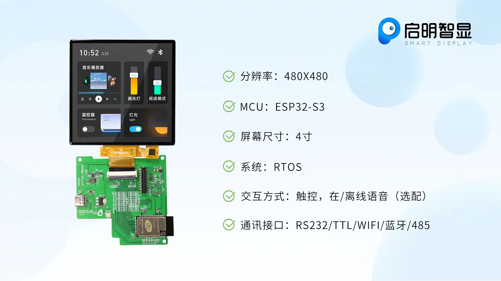
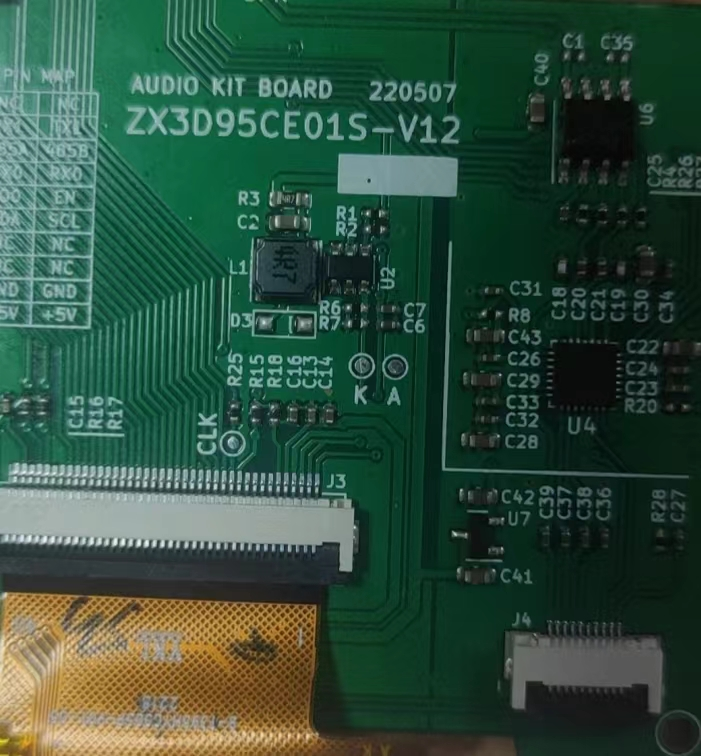

## 硬件说明
* 启明ZX3D95CE01S-AR-4848开发板,UR也可以
* 
* 
## ESP-IDF版本
* 1、主要配置:
	    flash 4线 QIO 120MHz,PSRAM 8线 oct 120MHz;也可以不打psram 120mhz补丁,将flash、PSRAM运行在80MHz
     下面链接是基于ESP-IDF v4.4.2-388-g755ce1077d打psram 120mhz补丁链接	
* ESP-IDF测试版本:https://gitee.com/Vancouver2017/esp-idf-patch/tree/release%2Fv4.4/
* 2、comments/esp_lcd组件是基于ESP-IDF 5.0的ESP32-S3针对RGB驱动优化，适配到ESP-IDF 4.4;修改地方只有几处,可以自己优化
## 打开vTaskList监测栈空间会影响刷屏
## 触摸
	espressif__esp_lcd_touch 乐鑫官方触摸驱动
## RGB屏
	3.95寸,480*480，ST7701S+GT911、GC9503CV+FT633U,2款屏均可使用
## gitee:实现其他仓库代码持续同步更新到自己仓库
* 1.创建空的仓库A，并克隆仓库B的代码到本地
	git clone 仓库B代码地址
* 2.进入项目克隆的代码项目中，删除原有git文件
	rm -rf .git
* 3.初始化仓库，让它变成属于我们的仓库A
	git init
* 5.LF和CRLF转换(可选)
	使用git add 命令的时候，弹出了一个警告 warning: LF will be replaced by CRLF in ******
		LF和CRLF其实都是换行符，但是不同的是，LF是linux和Unix系统的换行符，CRLF是window 系统的换行符。
		这就给跨平台的协作的项目带来了问题，保存文件到底是使用哪个标准呢？ 
		git为了解决这个问题，提供了一个”换行符自动转换“的功能，并且这个功能是默认处于”自动模式“即开启状态的。
		这个换行符自动转换会把自动把你代码里 与你当前操作系统不相同的换行的方式 转换成当前系统的换行方式（即LF和CRLF 之间的转换），
		这样一来，当你提交代码的时候，即使你没有修改过某个文件，也被git认为你修改过了，从而提示"LF will be replaced by CRLF in *****"

	解决办法
		最简单的一种办法就是把自动转换功能关掉即可。
		输入命令：
				git config core.autocrlf false (仅对当前git仓库有效）
				git config --global core.autocrlf false (全局有效，不设置推荐全局）
 	
* 6.将代码添加到暂存区			
		git add .
* 7.将暂存区代码添加到本地仓库	
		git commit -m "注释"		
  8.提交代码
		git push origin master
